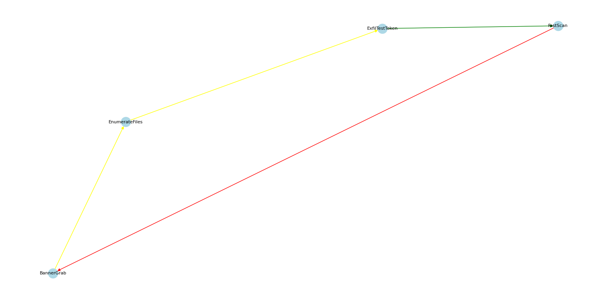

# Adaptive Human-Emulation Attack Engine (AHEA)

AHEA is a safe adversary emulator that simulates attacker behavior in a lab environment. It learns from defender reactions using reinforcement learning, retrains its ML predictor with real run data, and visualizes evolving attack paths in a dynamic attack graph.
---

## ✨ Features
- **Learning engine:** Q-values evolve as the engine runs.
- **Attack graph visualization:** NetworkX + Matplotlib with colored edges (green/yellow/red).
- **CSV logging:** Epoch-by-epoch actions, rewards, defender reactions.
- **ML retraining:** Decision tree retrains on `run_log.csv`.

---

## 🚀 Quick Start

### 1. Install dependencies
```bash
pip install -r requirements.txt

